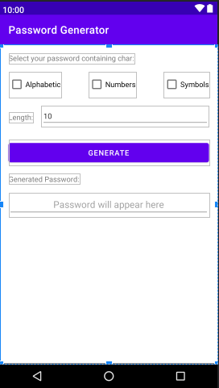

# Password Generator

Aplikasi android ini dibangun menggunakan Kotlin. Sederhana dan mudah untuk digunakan sebagai pembelajaran android untuk pemula. Berikut tampilan dari aplikasi tersebut: 

### Fitur:
1. Pilih character yang ingin di ramu (Alfabet, Number, Symbol, dan bisa campur)
2. Menentukan panjang dari password (default: 10)
